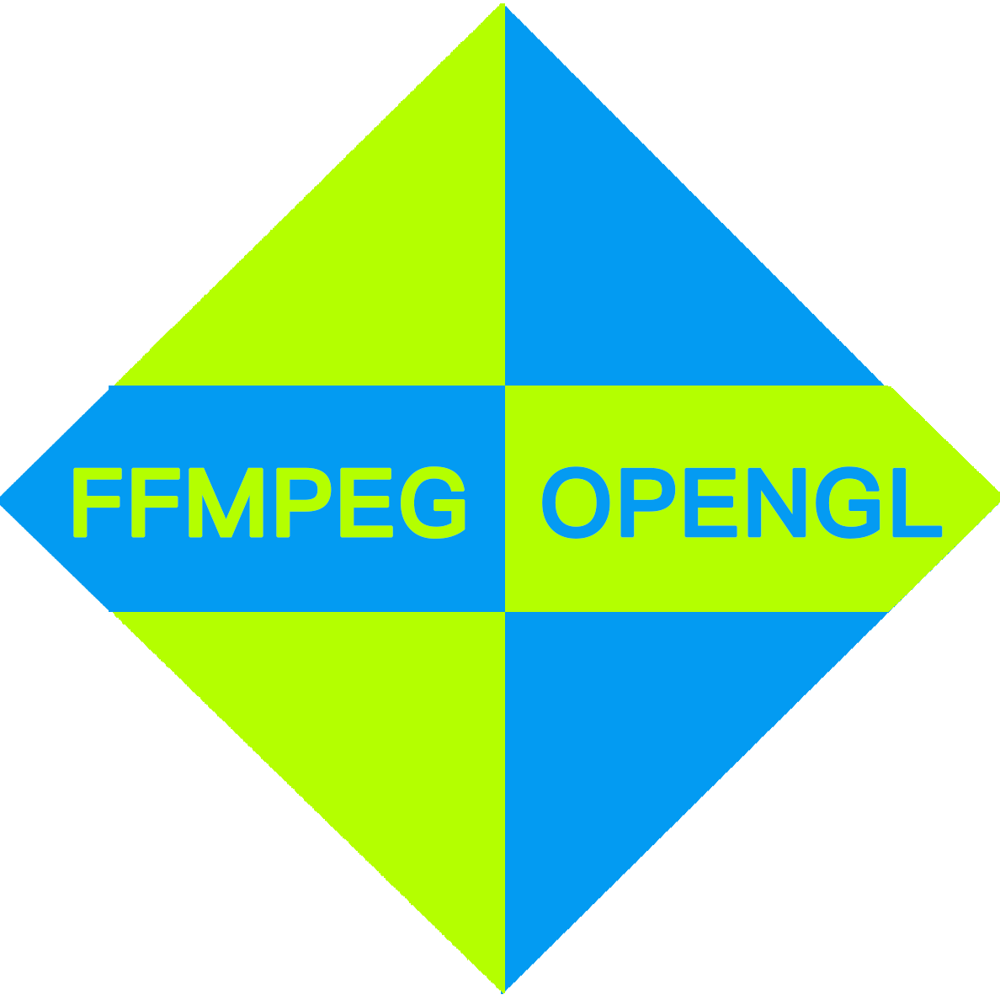
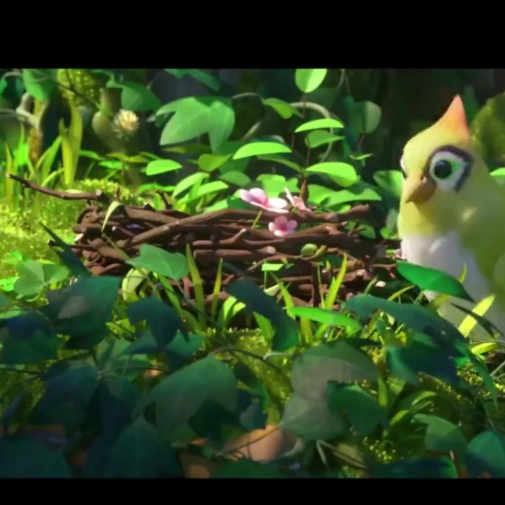
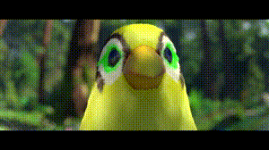
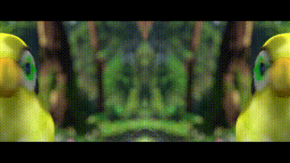
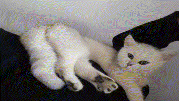
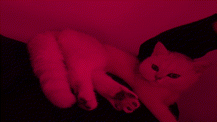
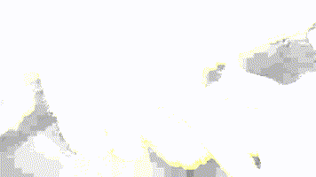
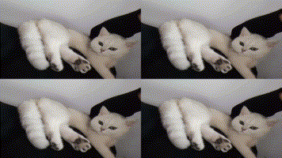
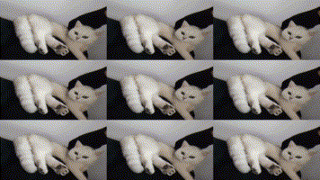
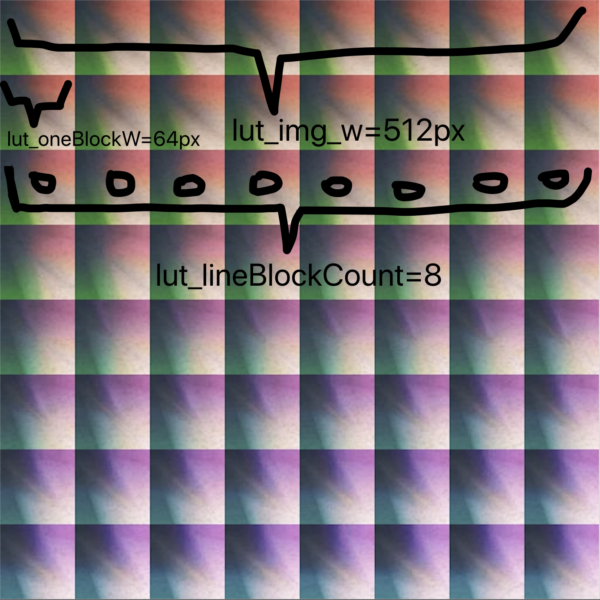

# FFmpeg Plus OpenGL(GLSL) - 视频编辑增强能力 

## <a href="README_EN.MD">English</a> | <a href="README.MD"><b>中文</b></a>

## <a href="README.MD"><b>渲染特效和LUT贴纸</b>请点这里</a> | <a href="README_FADE.MD"><b>转场特效</b>请点这里</a> | <a href="README_PIP.MD"><b>画中画特效</b>请点这里</a>



#### 让FFmpeg拥有GLSL图形渲染能力

> `Shader++`是此AVFilter的`Shader在线调试`工具：(编写的Shader可与本AVFilter公用)
>
> https://www.zzsin.com/shaderplus.html
>
> 

<hr>

- [介绍](#介绍)
    - [更新日志](#更新日志)
    - [使用示例展示](#使用示例展示)

- [如何使用 FFmpeg+OpenGL Shader Filter: vf_glplusshader](#ffmpeg-plus-gl-shader)
    
    - [目录结构](#目录结构)
    - [编译构建](#编译构建)
    - [运行](#运行)
        - [GLSL Shader渲染](#shader渲染)
        - [Lut look-up-table Shader渲染](#lut渲染)

- [相关帮助](#相关帮助)
    - [FFmpeg编译相关帮助 - 如果不知道FFmpeg是如何编译怎么办](#FFmpeg编译相关帮助)

- [关于作者 - 联系方式](#关于作者)

## 介绍 ##

一个可以在FFmpeg cmd里使用的OpenGL滤镜，可以自己写shader并且动态加载渲染。

可以使用 <a href="Plus-GL-Shader">滤镜 `plusglshader`</a> 来渲染你的视频。

### 更新日志 ###

| 更新日志 | 内容 |
| ---- | ---- |
| 时间 | 2021/10/17 |
| - | 1.`fadeglshader` 支持转场特效 |
| - | 2.`pipglshader` 支持画中画特效 |
| 时间 | 2021/08/16 |
| - | 1.`lutglshader` LUT 贴纸滤镜支持 自定义LUT大小渲染能力 |
| 时间 | 2021/08/15 |
| - | 1.`plusglshader`支持透明通道渲染, PR by <a href="https://github.com/numberwolf/FFmpeg-Plus-OpenGL/pull/25">Pull Request:#25</a> |
| 时间 | 2021/07/06 |
| - | 1.filter兼容FFMpeg仓库最新版本 |
| 时间 | 2021/06/26 |
| - | 1.增加lut贴纸能力 |


### 使用示例展示 ###

* 示例脚本 <a href="Plus-GL-Shader/run.sh">`Plus-GL-Shader/run.sh`</a>

* 示例Shaders: <a href="Plus-GL-Shader/gl">`示例Shader目录 ./Plus-GL-Shader/gl`</a>

* 效果如下

| filter | shader name | source | render |
| - | - | - | - |
| plusglshader [GLSL Shader渲染](#shader渲染) | Fragments Shader: <br><a href="Plus-GL-Shader/gl/star_shader.gl">Plus-GL-Shader/gl/star_shader.gl</a><br>Vertex Shader: <br><a href="Plus-GL-Shader/gl/star_vertex.gl">Plus-GL-Shader/gl/star_vertex.gl</a> |  |  |
| lutglshader [Lut look-up-table Shader渲染](#lut渲染) | Fragments Shader: <br><a href="Plus-GL-Shader/gl/lut_shader.gl">Plus-GL-Shader/gl/lut_shader.gl</a><br>Vertex Shader: <br><a href="Plus-GL-Shader/gl/lut_vertex.gl">Plus-GL-Shader/gl/lut_vertex.gl</a> |  |  |
| plusglshader [GLSL Shader渲染](#shader渲染) | Fragments Shader: <br><a href="Plus-GL-Shader/gl/light_shader.gl">Plus-GL-Shader/gl/light_shader.gl</a><br>Vertex Shader: <br><a href="Plus-GL-Shader/gl/light_vertex.gl">Plus-GL-Shader/gl/light_vertex.gl</a> |  |  |
| plusglshader [GLSL Shader渲染](#shader渲染) | Fragments Shader: <br><a href="Plus-GL-Shader/gl/mirror_shader.gl">Plus-GL-Shader/gl/mirror_shader.gl</a><br>Vertex Shader: <br><a href="Plus-GL-Shader/gl/mirror_vertex.gl">Plus-GL-Shader/gl/mirror_vertex.gl</a> |  |  |
| plusglshader [GLSL Shader渲染](#shader渲染) | Fragments Shader: <br><a href="Plus-GL-Shader/gl/sway_shader.gl">Plus-GL-Shader/gl/sway_shader.gl</a><br>Vertex Shader: <br><a href="Plus-GL-Shader/gl/sway_vertex.gl">Plus-GL-Shader/gl/sway_vertex.gl</a> |  |  |
| plusglshader [GLSL Shader渲染](#shader渲染) | Fragments Shader: <br><a href="Plus-GL-Shader/gl/jitter_shader.gl">Plus-GL-Shader/gl/jitter_shader.gl</a><br>Vertex Shader: <br><a href="Plus-GL-Shader/gl/jitter_vertex.gl">Plus-GL-Shader/gl/jitter_vertex.gl</a> |  |  |
| plusglshader [GLSL Shader渲染](#shader渲染) | Fragments Shader: <br><a href="Plus-GL-Shader/gl/preview_shader.gl">Plus-GL-Shader/gl/preview_shader.gl</a><br>Vertex Shader: <br><a href="Plus-GL-Shader/gl/preview_vertex.gl">Plus-GL-Shader/gl/preview_vertex.gl</a> |  |  |
| plusglshader [GLSL Shader渲染](#shader渲染) | Fragments Shader: <br><a href="Plus-GL-Shader/gl/soul_shader.gl">Plus-GL-Shader/gl/soul_shader.gl</a><br>Vertex Shader: <br><a href="Plus-GL-Shader/gl/soul_vertex.gl">Plus-GL-Shader/gl/soul_vertex.gl</a> |  |  |
| plusglshader [GLSL Shader渲染](#shader渲染) | Fragments Shader: <br><a href="Plus-GL-Shader/gl/split_interval_shader.gl">Plus-GL-Shader/gl/split_interval_shader.gl</a><br>Vertex Shader: <br><a href="Plus-GL-Shader/gl/split_interval_vertex.gl">Plus-GL-Shader/gl/split_interval_vertex.gl</a> |  |  |
| plusglshader [GLSL Shader渲染](#shader渲染) | Fragments Shader: <br><a href="Plus-GL-Shader/gl/stab_ci_shader.gl">Plus-GL-Shader/gl/stab_ci_shader.gl</a><br>Vertex Shader: <br><a href="Plus-GL-Shader/gl/stab_ci_vertex.gl">Plus-GL-Shader/gl/stab_ci_vertex.gl</a> |  |  |
| plusglshader [GLSL Shader渲染](#shader渲染) | Fragments Shader: <br><a href="Plus-GL-Shader/gl/test_shader.gl">Plus-GL-Shader/gl/test_shader.gl</a><br>Vertex Shader: <br><a href="Plus-GL-Shader/gl/test_vertex.gl">Plus-GL-Shader/gl/test_vertex.gl</a> |  |  |
| plusglshader [GLSL Shader渲染](#shader渲染) | Fragments Shader: <br><a href="Plus-GL-Shader/gl/white_mask_shader.gl">Plus-GL-Shader/gl/white_mask_shader.gl</a><br>Vertex Shader: <br><a href="Plus-GL-Shader/gl/white_mask_vertex.gl">Plus-GL-Shader/gl/white_mask_vertex.gl</a> |  |  |
| plusglshader [GLSL Shader渲染](#shader渲染) | Fragments Shader: <br><a href="Plus-GL-Shader/gl/split_4_shader.gl">Plus-GL-Shader/gl/split_4_shader.gl</a><br>Vertex Shader: <br><a href="Plus-GL-Shader/gl/split_4_vertex.gl">Plus-GL-Shader/gl/split_4_vertex.gl</a> |  |  |
| plusglshader [GLSL Shader渲染](#shader渲染) | Fragments Shader: <br><a href="Plus-GL-Shader/gl/split_9_shader.gl">Plus-GL-Shader/gl/split_9_shader.gl</a><br>Vertex Shader: <br><a href="Plus-GL-Shader/gl/split_9_vertex.gl">Plus-GL-Shader/gl/split_9_vertex.gl</a> |  |  |
| plusglshader [GLSL Shader渲染](#shader渲染) | Fragments Shader: <br><a href="Plus-GL-Shader/gl/split_vert2_shader.gl">Plus-GL-Shader/gl/split_vert2_shader.gl</a><br>Vertex Shader: <br><a href="Plus-GL-Shader/gl/split_vert2_vertex.gl">Plus-GL-Shader/gl/split_vert2_vertex.gl</a> |  |  |

## FFmpeg-Plus-GL-Shader ##

### 目录结构 ###

* Filter Source Code Path: <a href="Plus-GL-Shader">Plus-GL-Shader</a>

    * libavfilter.diff

    * vf_plusglshader.c
    
    * vf_lutglshader.c

### 编译构建 ###

* 相关依赖
    * Centos 7.x+ || Linux

        * 第一步 安装相关依赖
            ```shell
            yum install -y glew glew-devel
            yum install -y glfw glfw-devel
            yum install -y mesa-dri-drivers

            #
            # If can not compile , you need
            #
            yum install -y libGLEW*
            yum install -y mesa
            yum install -y mesa-libGLU mesa-libGLU-devel
            yum install -y libXfont*
            ```

        * 第二步（可选）
            > 如果你在无显卡环境下跑此滤镜（比如你的生产环境服务器）,需要xvfb的支持

            ```shell
            yum install -y xorg-x11-server-Xvfb 
            ```

    * Ubuntu || Linux

        * 第一步 安装相关依赖
            ```shell
            apt-get install libglfw3-dev libglfw3
            apt-get install libglew2.0 libglew-dev
            ```

        * 第二步（可选）
            > 如果你在无显卡环境下跑此滤镜（比如你的生产环境服务器）,需要xvfb的支持

            ```shell
            apt-get install xvfb
            ```

    * MacOS下编译 （需要brew支持）
        ```shell
        brew install glew glfw
        ```

* 编译构建

    * 下载源码
        ```shell
        git clone https://github.com/numberwolf/FFmpeg-Plus-OpenGL.git
      
        git clone https://github.com/FFmpeg/FFmpeg.git # for 4.1x ~ 4.3x
        # 或者: wget -O ffmpeg.tar.gz "https://github.com/FFmpeg/FFmpeg/archive/refs/tags/n4.3.1.tar.gz"
        
        cd FFmpeg
        
        #
        # Patch
        #
        cp ../FFmpeg-Plus-OpenGL/Plus-GL-Shader/vf_plusglshader.c libavfilter/
        cp ../FFmpeg-Plus-OpenGL/Plus-GL-Shader/vf_lutglshader.c libavfilter/
        cp ../FFmpeg-Plus-OpenGL/Plus-GL-Shader/vf_pipglshader.c libavfilter/
        cp ../FFmpeg-Plus-OpenGL/Plus-GL-Shader/vf_fadeglshader.c libavfilter/
        git apply ../FFmpeg-Plus-OpenGL/Plus-GL-Shader/libavfilter.diff
        ```

    * 编译
        * 编译的`必选项` - 和此滤镜相关
            > --enable-opengl \
            > --extra-libs='-lGLEW -lglfw' \
            > --enable-filter=plusglshader \
            > --enable-filter=lutglshader \
            > --enable-filter=fadeglshader \
            > --enable-filter=pipglshader

        * 编译示例 - 可以不参考此示例，但是必须加上`必选项`
            ```shell
            #!/bin/bash
            ./configure \
              --enable-cross-compile \
              --pkg-config-flags="--static" \
              --extra-ldflags="-lm -lz -llzma -lpthread" \
              --extra-libs=-lpthread \
              --extra-libs=-lm \
              --enable-gpl \
              --enable-libfdk_aac \
              --enable-libfreetype \
              --enable-libmp3lame \
              --enable-libx264 \
              --enable-nonfree \
              --disable-shared \
              --enable-static \
              --enable-opengl \
              --extra-libs='-lGLEW -lglfw' \
              --enable-filter=plusglshader \
              --enable-filter=lutglshader \
              --enable-filter=fadeglshader \
              --enable-filter=pipglshader
            make clean
            make -j16
            make install
            ```

### 运行 ###

#### shader渲染 ####

* 检查 `Plus-GL-Shader`:`plusglshader` 滤镜是否安装成功
    * 检查命令
        ```shell
        ffmpeg -help filter=plusglshader
        ```

    * 正确输出
        ```shell
        ffmpeg version a0d68e65 Copyright (c) 2000-2020 the FFmpeg developers
          built with Apple LLVM version 10.0.0 (clang-1000.10.44.4)
          configuration: --enable-cross-compile --pkg-config-flags=--static --extra-ldflags='-lm -lz -llzma -lpthread' --extra-libs=-lpthread --extra-libs=-lm --enable-gpl --enable-libfdk_aac --enable-libfreetype --enable-libmp3lame --enable-libopus --enable-libvpx --enable-libx264 --enable-libx265 --enable-libass --enable-libfreetype --enable-libfontconfig --enable-libfribidi --enable-libwebp --enable-nonfree --disable-shared --enable-static --enable-opengl --extra-libs='-lGLEW -lglfw' --enable-filter=plusglshader --enable-filter=lutglshader --enable-filter=fadeglshader --enable-filter=pipglshader
          libavutil      56. 51.100 / 56. 51.100
          libavcodec     58. 91.100 / 58. 91.100
          libavformat    58. 45.100 / 58. 45.100
          libavdevice    58. 10.100 / 58. 10.100
          libavfilter     7. 85.100 /  7. 85.100
          libswscale      5.  7.100 /  5.  7.100
          libswresample   3.  7.100 /  3.  7.100
          libpostproc    55.  7.100 / 55.  7.100
        Filter plusglshader
          Generic OpenGL shader filter
            Inputs:
               #0: default (video)
            Outputs:
               #0: default (video)
        plusglshader AVOptions:
          sdsource          <string>     ..FV...... gl fragment shader source path (default is render gray color)
          vxsource          <string>     ..FV...... gl vertex shader source path (default is render gray color)
          start             <duration>   ..FV...... gl render start timestamp, if you set this option, must greater than zero(no trim) (default 0)
          duration          <duration>   ..FV...... gl render duration, if you set this option, must greater than zero(no trim) (default 0)
        
        This filter has support for timeline through the 'enable' option.

        This filter has support for timeline through the 'enable' option.
        ```

* 使用`plusglfilter`转码渲染 (Transcoding)

    > plusglshader=sdsource='./test_shader.gl':vxsource='./test_vertex.gl'

    * 参数项
    
        * `sdsource` : 片元着色器文件路径 (默认为灰度效果)
        * `vxsource` : 定点着色器文件路径 (默认不做任何处理)
        * `start` : Shader渲染生效起始时间点
        * `duration` : Shader渲染生效时长,超出部分帧不做处理

    * 滤镜使用规则 - 示例

        * `plusglshader`
        * `plusglshader=sdsource='./test_shader.gl':vxsource='./test_vertex.gl'`
        * `plusglshader=sdsource='./test_shader.gl':vxsource='./test_vertex.gl':duration=10`
        * `plusglshader=sdsource='./test_shader.gl':vxsource='./test_vertex.gl':start=5:duration=10`
        * 多个`plusglshader`渲染示例
            ```bash
            ffmpeg -v debug \
            -ss 40 -t 15 -i /Users/numberwolf/Documents/webroot/VideoMissile/VideoMissilePlayer/demo/res/cg.mp4 \
            -filter_complex \
            "plusglshader=sdsource=gl/jitter_shader.gl:vxsource=gl/jitter_vertex.gl:duration=10.1[out1];
            [out1]plusglshader=sdsource=gl/sway_shader.gl:vxsource=gl/sway_vertex.gl:duration=5[out2];
            [out2]plusglshader=sdsource=gl/split_9_shader.gl:vxsource=gl/split_9_vertex.gl:start=3:duration=3" \
            -vcodec libx264 \
            -an \
            -f mp4 -y output.mp4
            ```
    
    * 用你自己的Shader渲染

        * 1) Fragment shader
            > Example: <a href="Plus-GL-Shader/test_shader.gl">test_shader.gl</a>

            #### Notice: playTime is timestamp, from 0 -> end

            ```c
            uniform sampler2D tex;
            uniform float playTime;
            varying vec2 texCoord;
            void main() {
                gl_FragColor = texture2D(tex, texCoord * 0.5 + 0.5);
                float usePts = max(playTime, 0.4);
                float gray = (gl_FragColor.r + gl_FragColor.g + gl_FragColor.b) / (usePts * usePts);
                gl_FragColor.r = gray;
                gl_FragColor.g = gray;
                gl_FragColor.b = gray;
            }
            ```

        * 2) Vertex shader
            > Example: <a href="Plus-GL-Shader/test_vertex.gl">test_vertex.gl</a>

            ```c
            attribute vec2 position;
            varying vec2 texCoord;
            void main(void) {
                gl_Position = vec4(position, 0, 1);
                texCoord = position;
            }
            ```

    * 如果在无头（无显示器显卡环境下）环境下使用

        > 你需要xvfb server支持,使用如下命令

        ```shell
        xvfb-run -a --server-args="-screen 0 1280x720x24 -ac -nolisten tcp -dpi 96 +extension RANDR" \
        ffmpeg -v debug \
        -i 1000p10s_9k.mp4 \
        -filter_complex "[0:v]plusglshader=sdsource='./test_shader.gl':vxsource='./test_vertex.gl'[1outgl];[1outgl]scale=1280:-2" \
        -vcodec libx264 \
        -an \
        -pix_fmt yuv420p \
        -y test.mp4
        ```

    * 在有头（显卡 显示器）环境下运行

        ```shell
        ffmpeg -v debug \
        -i 1000p10s_9k.mp4 \
        -filter_complex "[0:v]plusglshader=sdsource='./test_shader.gl':vxsource='./test_vertex.gl'[1outgl];[1outgl]scale=1280:-2" \
        -vcodec libx264 \
        -an \
        -pix_fmt yuv420p \
        -y test.mp4
        ```

    * 输出示例

        | Tag | Src | Dst |
        |-|-|-|
        | Frame |  |  |
        
        
#### lut渲染 ####

* 检查 `Plus-GL-Shader`:`lutglshader` 滤镜是否安装成功
    * 检查命令
        ```shell
        ffmpeg -help filter=lutglshader
        ```

    * 正确输出
        ```shell
        ffmpeg version d48da9a Copyright (c) 2000-2020 the FFmpeg developers
          built with Apple LLVM version 10.0.0 (clang-1000.10.44.4)
          configuration: --enable-cross-compile --pkg-config-flags=--static --extra-ldflags='-lm -lz -llzma -lpthread' --extra-libs=-lpthread --extra-libs=-lm --enable-gpl --enable-libfdk_aac --enable-libfreetype --enable-libmp3lame --enable-libopus --enable-libvpx --enable-libx264 --enable-libx265 --enable-libass --enable-libfreetype --enable-libfontconfig --enable-libfribidi --enable-libwebp --enable-nonfree --disable-shared --enable-static --enable-opengl --extra-libs='-lGLEW -lglfw' --enable-filter=plusglshader --enable-filter=lutglshader --enable-filter=fadeglshader --enable-filter=pipglshader
          libavutil      56. 51.100 / 56. 51.100
          libavcodec     58. 91.100 / 58. 91.100
          libavformat    58. 45.100 / 58. 45.100
          libavdevice    58. 10.100 / 58. 10.100
          libavfilter     7. 85.100 /  7. 85.100
          libswscale      5.  7.100 /  5.  7.100
          libswresample   3.  7.100 /  3.  7.100
          libpostproc    55.  7.100 / 55.  7.100
        Filter lutglshader
          Render Frame by GL shader with LUT
            Inputs:
               #0: default (video)
            Outputs:
               #0: default (video)
        lutglshader AVOptions:
            sdsource          <string>     ..FV...... gl fragment shader source path (default is render lut fragment)
            vxsource          <string>     ..FV...... gl vertex shader source path (default is render lut vertex)
            start             <duration>   ..FV...... gl render start timestamp, if you set this option, must greater than zero(no trim) (default 0)
            duration          <duration>   ..FV...... gl render duration, if you set this option, must greater than zero(no trim) (default 0)
            lut_source        <string>     ..FV...... gl fragment shader externTex's source file (default is null). always for lut
            lut_type          <int>        ..FV...... ext type(0:media 1:rgb24 default is 0) (from 0 to INT_MAX) (default 0)
            lut_img_w         <int>        ..FV...... ext's width, when ext type is 1:rgb24, need be set. default is 512 (from 0 to INT_MAX) (default 512)
            lut_img_h         <int>        ..FV...... ext's height, when ext type is 1:rgb24, need be set. default is 512 (from 0 to INT_MAX) (default 512)
            lut_lineBlockCount <int>        ..FV...... lut color-block's count every line in lut-table(default is 8) (from 0 to INT_MAX) (default 8)
            lut_oneBlockW     <int>        ..FV...... lut color-block's width every block(default is 64) (from 0 to INT_MAX) (default 64)
        
        This filter has support for timeline through the 'enable' option.
        ```
      
      
* 使用`lutglfilter`转码渲染 (Transcoding)

    > IMG: lutglshader=`lut_source=./lut.jpg:lut_type=0`:duration=5'
    >
    > RGB: lutglshader=`lut_source=./lut.rgb:lut_type=1`:duration=5'

    * 参数项
    
        * `lut_source` : lut二维贴纸路径 (默认NULL)
            > 
            >   
            > 如图 512x512 <a href="Plus-GL-Shader/resource/lut.jpg">./resource/lut.jpg</a>
        * `lut_type` : lut贴纸类型 0:图片 1:RGB24文件 (默认为图片)
        * `sdsource` : 片元着色器文件路径 (默认为灰度效果)
        * `vxsource` : 定点着色器文件路径 (默认不做任何处理)
        * `lut_img_w` : LUT贴纸宽度像素 eg: 512 (px)
        * `lut_img_h` : LUT贴纸高度像素
        * `lut_lineBlockCount` : LUT贴纸 每行的色块Block有多少个 eg: (512x512的一行block有8个 如上面图片所示)
        * `lut_oneBlockW` : LUT贴纸 每个色块Block宽度多少像素
        * `start` : Shader渲染生效起始时间点
        * `duration` : Shader渲染生效时长,超出部分帧不做处理
        
    * 滤镜使用规则 - 示例
    
        * RGB文件 LUT表图
            * `lutglshader=lut_source=./lut.rgb:lut_type=1`
            * `lutglshader=lut_source=./lut.rgb:lut_type=1:duration=5:lut_img_w=512:lut_img_h=512`
            * `lutglshader=lut_source=./lut.rgb:lut_type=1:duration=5:lut_img_w=512:lut_img_h=512:lut_lineBlockCount=8:lut_oneBlockW=64`
            * `lutglshader=lut_source=./lut.rgb:lut_type=1:duration=5:lut_img_w=512:lut_img_h=512:lut_lineBlockCount=8:lut_oneBlockW=64:sdsource=gl/lut_shader.gl:vxsource='./lut_vertex.gl'`
            * `lutglshader=lut_source=./lut.rgb:lut_type=1:start=1:duration=5:lut_img_w=512:lut_img_h=512:lut_lineBlockCount=8:lut_oneBlockW=64:sdsource=gl/lut_shader.gl:vxsource='./lut_vertex.gl'`
        
        * Image 图片(JPG/PNG) LUT表图
            * `lutglshader=lut_source=./lut.jpg`
            * `lutglshader=lut_source=./lut.jpg:lut_type=0`
            * `lutglshader=lut_source=./lut.jpg:lut_type=0:lut_lineBlockCount=8:lut_oneBlockW=64`
            * `lutglshader=lut_source=./lut.jpg:lut_type=0:lut_lineBlockCount=8:lut_oneBlockW=64:start=1:duration=5`
            
        * 使用`lutglshader`渲染示例
            ```bash
            ffmpeg -v debug \
            -ss 40 -t 15 -i cg.mp4 \
            -filter_complex \
            "lutglshader=lut_source=./lut.jpg" \
            -vcodec libx264 \
            -an \
            -f mp4 -y output.mp4
            ```
          
    * 用你自己的Shader渲染
    
        * Fragment shader
        
            ```c
            uniform sampler2D tex;
            uniform sampler2D externTex;
            varying vec2 TextureCoordsVarying;
            uniform float playTime;
            const float PI = 3.1415926;
            
            float rand(float n) {
                return fract(sin(n) * 43758.5453123);
            }
            
            vec4 lookupTable(vec4 color, float progress){
                //float blueColor = color.b * 63.0 * progress;
                float blueColor = color.b * 63.0;
            
                vec2 quad1;
                quad1.y = floor(floor(blueColor) / 8.0);
                quad1.x = floor(blueColor) - (quad1.y * 8.0);
            
                vec2 quad2;
                quad2.y = floor(ceil(blueColor) / 8.0);
                quad2.x = ceil(blueColor) - (quad2.y * 8.0);
            
                vec2 texPos1;
                texPos1.x = (quad1.x * 0.125) + 0.5/512.0 + ((0.125 - 1.0/512.0) * color.r);
                texPos1.y = (quad1.y * 0.125) + 0.5/512.0 + ((0.125 - 1.0/512.0) * color.g);
            
                vec2 texPos2;
                texPos2.x = (quad2.x * 0.125) + 0.5/512.0 + ((0.125 - 1.0/512.0) * color.r);
                texPos2.y = (quad2.y * 0.125) + 0.5/512.0 + ((0.125 - 1.0/512.0) * color.g);
            
                vec4 newColor1 = texture2D(externTex, texPos1);
                vec4 newColor2 = texture2D(externTex, texPos2);
                vec4 newColor = mix(newColor1, newColor2, fract(blueColor));
                return vec4(newColor.rgb, color.w);
            }
            
            void main() {
                float duration = 0.5;
                float progress = mod(playTime, duration) / duration; // 0~1
                vec4 imgColor = texture2D(tex, TextureCoordsVarying);
                vec4 lutColor = lookupTable(imgColor, progress);
                gl_FragColor = mix(imgColor, lutColor, 1.0);
            }
            ```


## 相关帮助 ##

#### FFmpeg编译相关帮助 ####

* <a href="Plus-GL-Shader">filter `plusglshader`</a>.
    * <a href="https://trac.ffmpeg.org/wiki/CompilationGuide">如果你不知道如何编译FFmpeg，请点这里</a>
    * [学会之后可以编译我们的 `plusglshader`</a>](#build)

## 关于作者 ##

#### Contact

* Github: 

    * https://github.com/numberwolf/FFmpeg-Plus-OpenGL
    * https://github.com/numberwolf/h265web.js

* Email(porschegt23@foxmail.com)

* QQ: 531365872

* QQ技术群: 925466059

* Discord:numberwolf#8694

* 微信:numberwolf11


