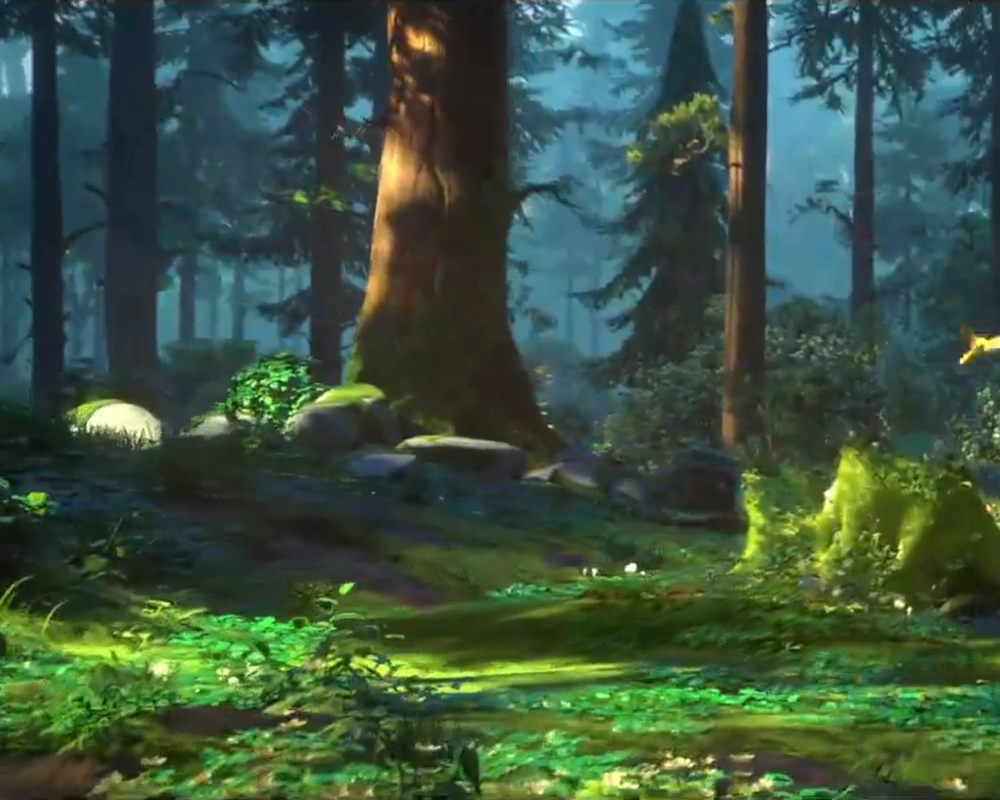
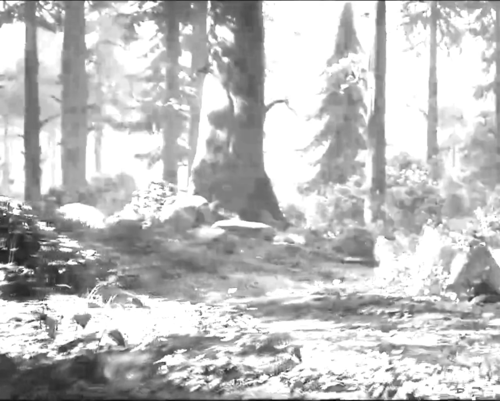

# FFmpeg Plus Filters

- [Introduce](#introduce)

- [Filters](#ffmpeg-plus-filters)

    - [FFmpeg Plus GL Shader: vf_glplusshader](#ffmpeg-plus-gl-shader)
        
        - [File Struct](#filestruct)
        - [Build](#build)
        - [Run](#run)

- [About](#about)

## Introduce ##

Some filters for ffmpeg.

You can use <a href="Plus-GL-Shader">filter `plusglshader`</a> to render frame by opengl's shader.

## FFmpeg-Plus-Filters ##

### FFmpeg-Plus-GL-Shader ###

#### FileStruct ####

* Path: <a href="Plus-GL-Shader">Plus-GL-Shader</a>

    * libavfilter.diff

    * vf_plusglshader.c

#### Build ####

* Dependencies
    * Centos 7.x+ || Linux

        * first
        ```shell
        yum install -y glew*
        yum install -y glfw*

        #
        # If can not compile , you need
        #
        yum install -y libGLEW*
        yum install -y mesa
        yum install -y mesa-libGLU mesa-libGLU-devel
        ```

        * second
            > If on headless environments

            > If you want to running on server machine without Video card

            ```shell
            yum install -y xorg-x11-server-Xvfb 
            ```

    * MacOS
    ```shell
    brew install glew glfw
    ```

* Compile

    * Download
    ```shell
    git clone https://github.com/numberwolf/FFmpeg-Plus-OpenGL-Shader-Filters.git
    git clone https://github.com/FFmpeg/FFmpeg.git # for 4.x+
    
    cd FFmpeg
    
    #
    # Patch
    #
    cp ../FFmpeg-Plus-OpenGL-Shader-Filters/Plus-GL-Shader/vf_plusglshader.c libavfilter/
    git apply ../FFmpeg-Plus-OpenGL-Shader-Filters/Plus-GL-Shader/libavfilter.diff
    ```

    * Build
        * Needed
            > --enable-opengl \
            > --extra-libs='-lGLEW -lglfw' \
            > --enable-filter=plusglshader

        * Example
            ```shell
            #!/bin/bash
            ./configure \
              --enable-cross-compile \
              --pkg-config-flags="--static" \
              --extra-ldflags="-lm -lz -llzma -lpthread" \
              --extra-libs=-lpthread \
              --extra-libs=-lm \
              --enable-gpl \
              --enable-libfdk_aac \
              --enable-libfreetype \
              --enable-libmp3lame \
              --enable-libopus \
              --enable-libvpx \
              --enable-libx264 \
              --enable-libx265 \
              --enable-libass \
              --enable-libfreetype       \
              --enable-libfontconfig     \
              --enable-libfribidi        \
              --enable-libwebp           \
              --enable-nonfree \
              --disable-shared \
              --enable-static \
              --enable-opengl \
              --extra-libs='-lGLEW -lglfw' \
              --enable-filter=plusglshader
            make clean
            make -j16
            make install
            ```

#### Run ####

* Check `Plus-GL-Shader`:`plusglshader` filter
    * Check
    ```shell
    ffmpeg -help filter=plusglshader
    ```

    * Output
    ```shell
    ffmpeg version a0d68e65 Copyright (c) 2000-2020 the FFmpeg developers
      built with Apple LLVM version 10.0.0 (clang-1000.10.44.4)
      configuration: --enable-cross-compile --pkg-config-flags=--static --extra-ldflags='-lm -lz -llzma -lpthread' --extra-libs=-lpthread --extra-libs=-lm --enable-gpl --enable-libfdk_aac --enable-libfreetype --enable-libmp3lame --enable-libopus --enable-libvpx --enable-libx264 --enable-libx265 --enable-libass --enable-libfreetype --enable-libfontconfig --enable-libfribidi --enable-libwebp --enable-nonfree --disable-shared --enable-static --enable-opengl --extra-libs='-lGLEW -lglfw' --enable-filter=plusglshader
      libavutil      56. 51.100 / 56. 51.100
      libavcodec     58. 91.100 / 58. 91.100
      libavformat    58. 45.100 / 58. 45.100
      libavdevice    58. 10.100 / 58. 10.100
      libavfilter     7. 85.100 /  7. 85.100
      libswscale      5.  7.100 /  5.  7.100
      libswresample   3.  7.100 /  3.  7.100
      libpostproc    55.  7.100 / 55.  7.100
    Filter plusglshader
      Generic OpenGL shader filter
        Inputs:
           #0: default (video)
        Outputs:
           #0: default (video)
    plusglshader AVOptions:
      sdsource          <string>     ..FV...... gl fragment shader source path (default is render gray color)
      vxsource          <string>     ..FV...... gl vertex shader source path (default is render gray color)

    This filter has support for timeline through the 'enable' option.
    ```

* Use it (Transcoding)

    > plusglshader=sdsource='./test_shader.gl':vxsource='./test_vertex.gl'

    * Params
    
        * `sdsource` : Fragment shader file path (Default is gray)
        * `vxsource` : Vertex shader file path (Default is gray)

    * Filter Rule

        * `plusglshader`
        * `plusglshader=sdsource='./test_shader.gl':vxsource='./test_vertex.gl'`
    
    * Write your own shader!

        * 1) Fragment shader
            > Example: <a href="Plus-GL-Shader/test_shader.gl">test_shader.gl</a>

            #### Notice: playTime is timestamp, from 0 -> end

            ```c
            uniform sampler2D tex;
            uniform float playTime;
            varying vec2 texCoord;
            void main() {
                gl_FragColor = texture2D(tex, texCoord * 0.5 + 0.5);
                float usePts = max(playTime, 0.4);
                float gray = (gl_FragColor.r + gl_FragColor.g + gl_FragColor.b) / (usePts * usePts);
                gl_FragColor.r = gray;
                gl_FragColor.g = gray;
                gl_FragColor.b = gray;
            }
            ```

        * 2) Vertex shader
            > Example: <a href="Plus-GL-Shader/test_vertex.gl">test_vertex.gl</a>

            ```c
            attribute vec2 position;
            varying vec2 texCoord;
            void main(void) {
                gl_Position = vec4(position, 0, 1);
                texCoord = position;
            }
            ```

    * Running with out video card || headless env

        > You need xvfb

        ```shell
        xvfb-run -a --server-args="-screen 0 1280x720x24 -ac -nolisten tcp -dpi 96 +extension RANDR" \
        ffmpeg -v debug \
        -i 1000p10s_9k.mp4 \
        -filter_complex "[0:v]plusglshader=sdsource='./test_shader.gl':vxsource='./test_vertex.gl'[1outgl];[1outgl]scale=1280:-2" \
        -vcodec libx264 \
        -an \
        -pix_fmt yuv420p \
        -y test.mp4
        ```

    * Running with video card

        ```shell
        ffmpeg -v debug \
        -i 1000p10s_9k.mp4 \
        -filter_complex "[0:v]plusglshader=sdsource='./test_shader.gl':vxsource='./test_vertex.gl'[1outgl];[1outgl]scale=1280:-2" \
        -vcodec libx264 \
        -an \
        -pix_fmt yuv420p \
        -y test.mp4
        ```

    * Output Example

        | Tag | Src | Dst |
        |-|-|-|
        | Frame |  |  |


## About ##

#### Contact

* Github: 

    * https://github.com/numberwolf/FFmpeg-Plus-OpenGL-Shader-Filters
    * https://github.com/numberwolf/h265web.js

* Email(porschegt23@foxmail.com)

* QQ: 531365872

* Discord:numberwolf#8694

* Wechat:numberwolf11


